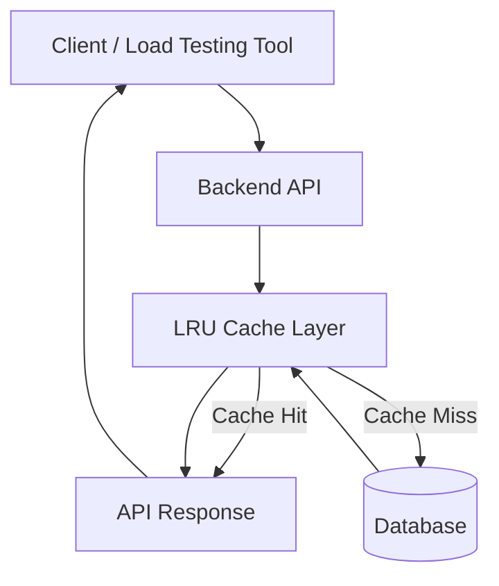

# Distributed Event System – Performance Analysis

## Project Overview
This project analyzes the performance of an event management API under heavy load.
The system was tested using load testing tools to evaluate scalability, response time, and throughput.

## 1 . System Architecture



## 1.1 Explanation

The system consists of the following components:

1. Client / Load Testing Tool

Simulates users sending requests
Generates GET and POST traffic

2. Backend API

Handles business logic
Processes /events and /event endpoints

3. LRU Cache Layer

Stores recently accessed event data
Reduces database calls for frequent requests

4. Database

Stores event records
Contains 3000 inserted records

## Load Testing Setup
### Traffic distribution:

| Request Type | Percentage |
|---------------|------------|
| GET /events   | 80%        |
| POST /event   | 20%        |

### Test Scenarios

| Users | Requests/sec |
|------|--------------|
| 100  | 5            |
| 500  | 10           |

### Testing Tool


Locust Load Testing


### Server Endpoint


http://localhost:8080
## Performance Analysis

### Baseline (Before Optimization)

| Metric | GET | POST |
|------|------|------|
| Avg Response | 10013 ms | 8541 ms |
| 95th Percentile | 16000 ms | 15000 ms |
| 99th Percentile | 22000 ms | 20000 ms |

### Problems Identified

- Large dataset retrieval  
- High database load  
- Very high latency


## 2. Optimization Techniques

### 1. Pagination

Pagination prevents the API from returning large datasets in a single request.

#### Benefits

- Reduced database load  
- Lower response times  
- Improved scalability  

---

### 2. Caching (Manual LRU Implementation)

Caching reduces repeated database queries by storing frequently accessed data in memory.

### Common Cache Eviction Algorithms

| Algorithm | Description |
|----------|-------------|
| LRU | Removes least recently used item |
| LFU | Removes least frequently used item |
| FIFO | Removes oldest inserted item |
| MRU | Removes most recently used item |

In this project, a **manual in-memory LRU cache** was implemented and tested for performance impact.


## 3. Optimisation Implementation :

## 3.1 Pagination Optimization

Pagination limits the number of records returned per request.

### Performance After Pagination

| Metric | GET | POST |
|------|------|------|
| Avg Response | 8.95 ms | 6.13 ms |
| 95th Percentile | 11 ms | 11 ms |
| 99th Percentile | 16 ms | 18 ms |

### Impact

- Response time reduced from **seconds to milliseconds**
- Smaller database queries
- Stable latency under load

## 3.2 LRU Cache Performance Results

### Load Test Configuration

| Users | Request Rate |
|------|--------------|
| 100 Users | 5 RPS |

---

### Results

| Metric | Value |
|------|------|
| Avg Latency | 18.65 ms |
| Median | 15 ms |
| 95th Percentile | 30 ms |
| Max Latency | 1441 ms |
| Throughput | ~54–67 RPS |
| Total Requests | ~51K |
| Failures | 0% |

## 3.3 Performance Comparison

| Metric | Without Cache | With LRU Cache | Insight |
|------|------|------|------|
| Avg Response | 8.95 ms | 18.65 ms | Higher due to cache invalidation |
| Median | 8 ms | 15 ms | Increased |
| 95th Percentile | 11 ms | 30 ms | Cache miss spikes |
| 99th Percentile | 16 ms | 72 ms | Higher tail latency |
| Failures | 0% | 0% | System stable |
| Throughput | ~50 RPS | ~67 RPS | Improved |

### Key Insight

Caching improved **throughput**, but did not significantly reduce latency due to frequent **POST operations invalidating the cache**.

This demonstrates an important backend principle:

> **Caching provides the greatest benefits in read-heavy systems with infrequent writes.**

## 4. API Documentation

### Create Event

**POST /event**

Creates a new event.

#### Request Body

```json
{
  "title": "Tech Conference",
  "location": "Bangalore",
  "date": "2026-04-01"
}
```

### Get Events

`GET /events`

Returns a **paginated list of events**.

#### Query Parameters

| Parameter | Description |
|----------|-------------|
| page | Page number |
| size | Number of records per page |

#### Example 
GET /events?page=1&size=10

## 5. Future Improvements

Potential improvements for making the system production-ready.

### Distributed Caching
Integrate **Redis** to support caching across multiple service instances.

### Load Balancing
Deploy multiple API instances behind a load balancer to distribute traffic efficiently.

### Database Optimization

- Add indexing on frequently queried columns
- Optimize database queries
- Improve connection pooling

### Monitoring

Integrate monitoring and observability tools such as:

- Prometheus
- Grafana
- Distributed tracing tools

---

## Technologies Used

- Java / Spring Boot
- REST APIs
- SQL Database
- Locust Load Testing
- Markdown + Mermaid Diagrams

This project demonstrates backend performance optimization using pagination, caching strategies, and load testing analysis.
